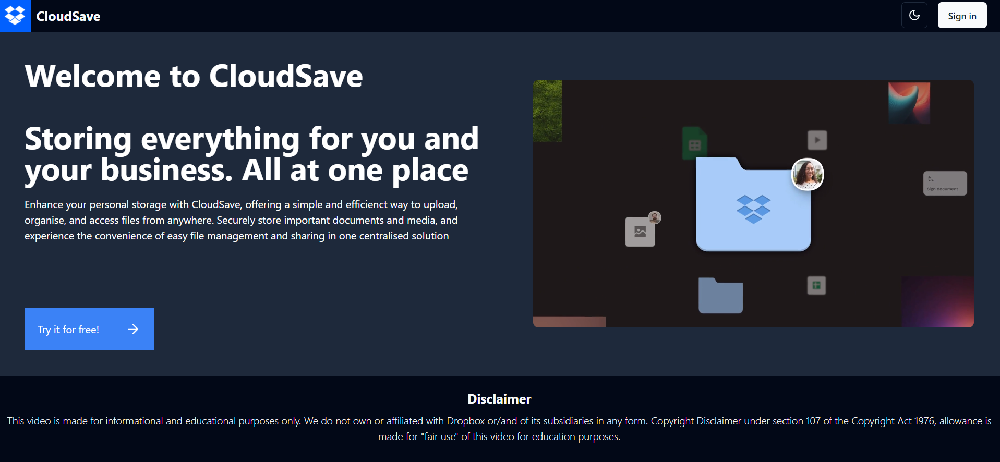
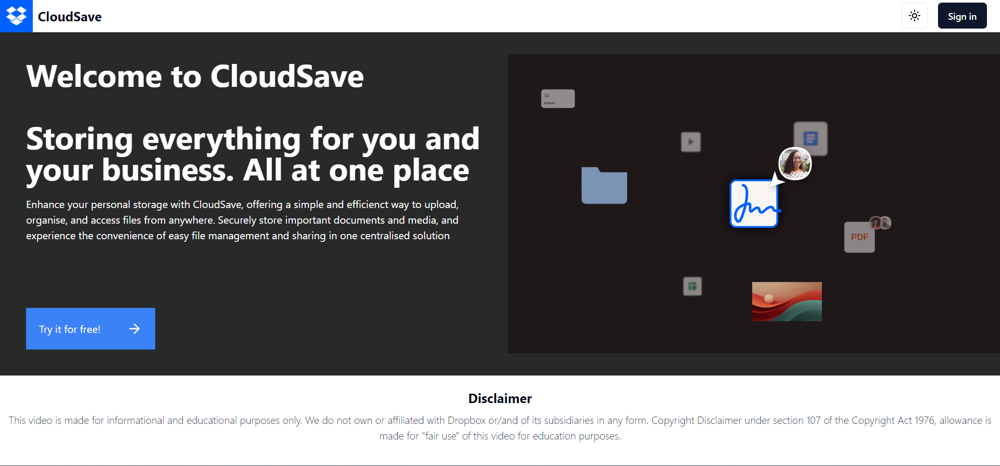
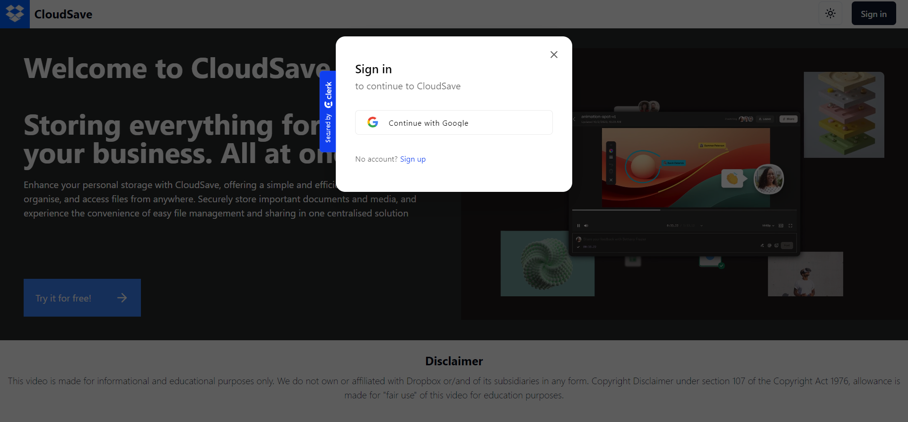
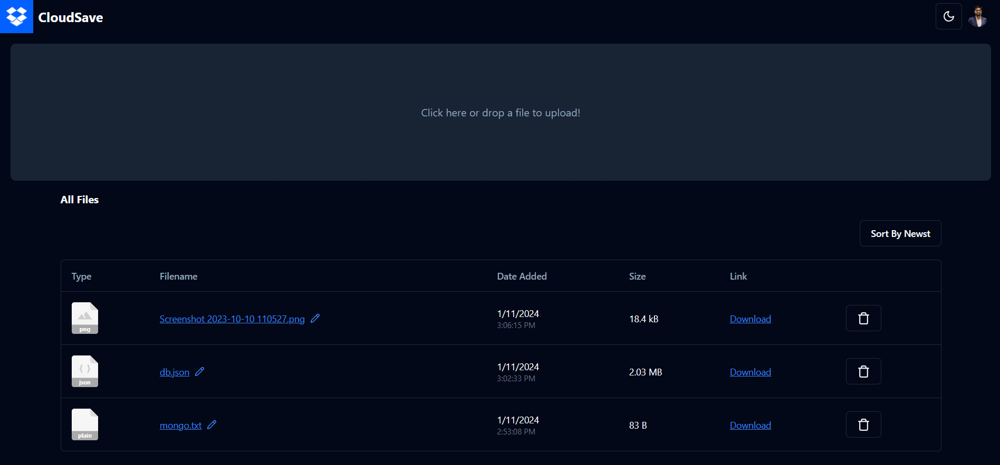
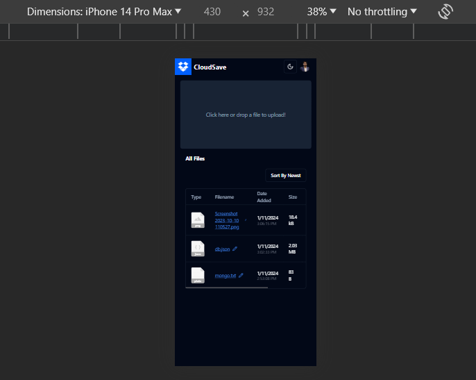

# CloudSave - Your Personal Cloud Storage Solution

CloudSave is a Dropbox-inspired cloud storage platform built with modern web technologies. It leverages Next.js for the frontend, Clerk for authentication, Shadcn for a sleek user interface, Zustand for state management, React Dropzone for file uploading, and Firebase for the backend infrastructure.

## Table of Contents

- [Features](#features)
- [Demo](#demo)
- [Getting Started](#getting-started)
  - [Prerequisites](#prerequisites)
  - [Installation](#installation)
- [Configuration](#configuration)
- [Usage](#usage)
- [Technologies Used](#technologies-used)

## Features

- **User Authentication:** CloudSave uses Clerk for secure and seamless user authentication.
- **Intuitive UI:** Shadcn provides a visually appealing and responsive user interface, ensuring an excellent user experience.
- **State Management:** Zustand is employed for efficient state management, providing a robust foundation for dynamic updates and interactions.
- **File Upload:** React Dropzone facilitates easy drag-and-drop file uploads, enhancing user convenience.
- **Backend Storage:** Firebase is used as the backend infrastructure for secure and scalable file storage.
- **Dark and Light Mode:** CloudSave offers both dark and light mode options to cater to users' preferences for a personalized experience.
- **Responsive Design:** The application is fully responsive, ensuring a seamless experience across various devices and screen sizes.


## Demo

Live URL : https://cloud-save.vercel.app/

Dark Mode:



Light Mode:



Sign-in Modal:



Dashboard:



Completely Responsive:



## Getting Started

### Prerequisites

Before you begin, ensure you have the following tools installed:

- Node.js and npm
- Firebase account and project setup
- Clerk account and API keys

### Installation

1. Clone the repository:

   ```bash
   git clone https://github.com/yourusername/cloudsave.git
   ```
2. Navigate to the project directory
    ```
    cd CloudSave
    ```
3. Install dependencies
    ```
    npm install
    ```

## Configuration
1. Create a `.env.local` file in the project root and add the following configuration:

    ```
    NEXT_PUBLIC_CLERK_PUBLISHABLE_KEY=
    CLERK_SECRET_KEY=
    ```
## Usage
1. Start the development server:
    ```
    npm run dev
    ```
    or
    ```
    yarn dev
    ```
2. Open your browser and navigate to http://localhost:3000.

## Technologies Used
    -Next.js - For front-end development
    -Clerk - For user-authenication
    -Shadcn - For UI integration
    -Zustand - For state-management
    -React-Dropzone - For drag-'n'-drop 
    -Firebase - For backend integration
